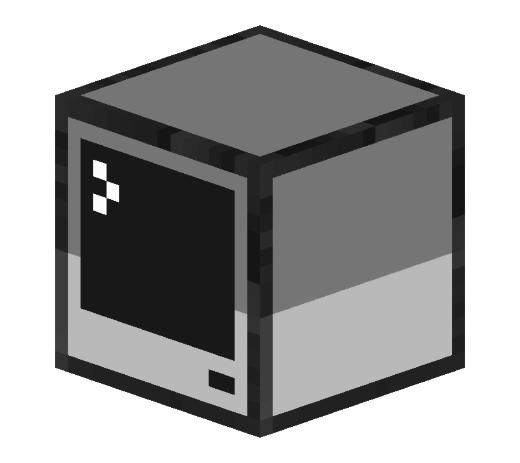
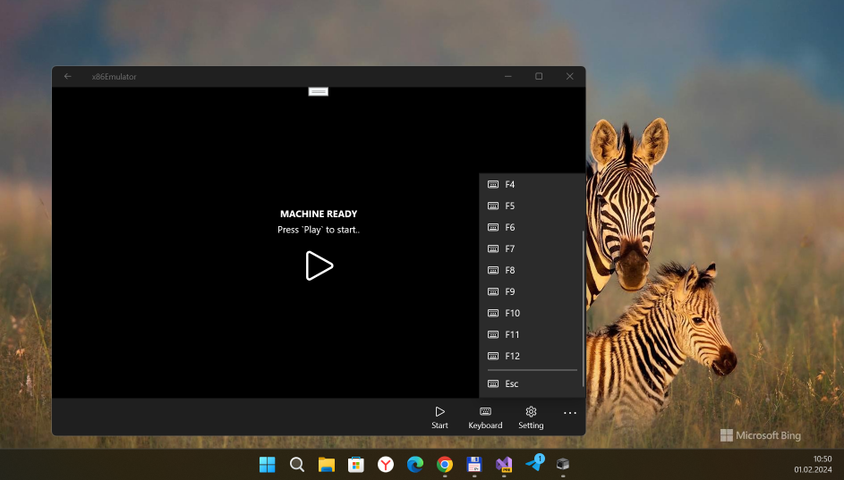
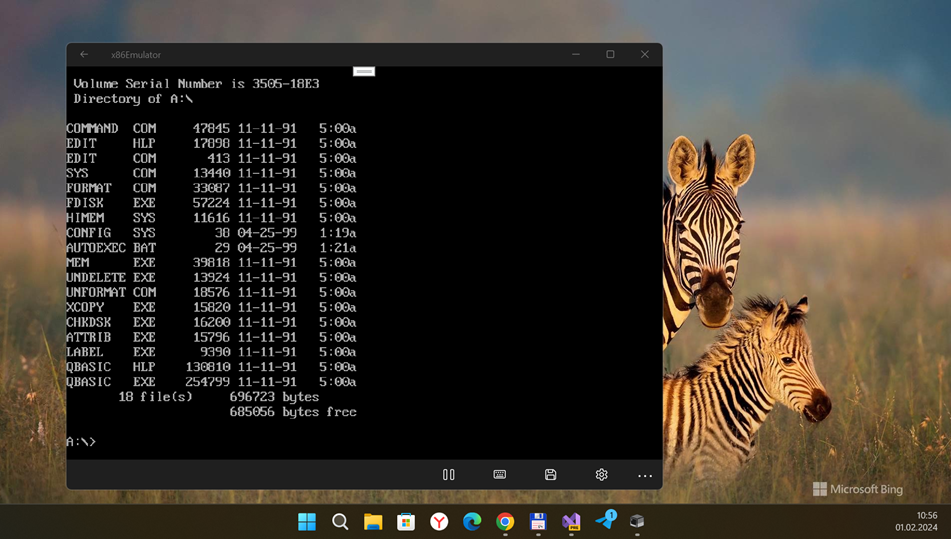

# x86Emulator v1.0.1.0 (v1.0-alpha; UWP edition)

"An x86 Virtual Machine written in C# - Why not..." - Stuart Walsh 


   
  <b>x86 Machine emulator</b> 
  <a href="./src">Source</a> |
  <a href="https://github.com/cryogen/VM86CS">Project</a> 
    


## Notice from x86Emulator-uwp creators/developers: 
*This is no longer maintained, purely uploaded and made public for those who are curious or wish to try fix any issues. Expect no future updates to this repo*

## My photos (or "images".. or "snapshots"? )))







## Tech. details
- Windows 10 Mobile used (ARM) for my own testing (but desktop Windows 11 OS is best choise for debug, heh!)
- Recommended Win. OS build: 19041
- Minimal supported  Win. OS build: 14393
- No F5 button... so QBASIC's app run not tested yet... (it's my special humor!)))


## Status
- [x] All functional keys "vistualization" :))))
- [x] Machine load
- [x] Boot from floppy
- [ ] Boot from CD-ROM
- [ ] Boot from HDD


## To-Do

- Add mouse support
- Fix HDD images support
- Fix CD-ROM image support
- Find better way to show (F1,F2..etc) on touch screens


## Credits

Original developer:

- [Stuart Walsh](https://github.com/cryogen)

UWP port development:

- [Empyreal96](https://github.com/Empyreal96)
- [Bashar Astifan](https://github.com/basharast)


Win2D render solution from (RetriX):

- [Alberto Fustinoni](https://github.com/albertofustinoni)


## .
Fast Windows10Mobile testing (Lumia 950):

- [MediaExplorer74](https://github.com/mediaexplorer74)

## ..
AS is. (For) my own small and poor RnD only. Just for fun :)

- [M]edia[E]xplorer 2024